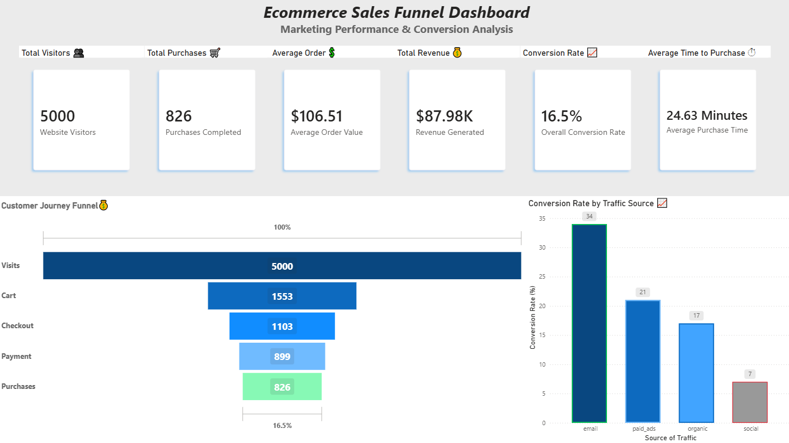

# 🛒 E-commerce Customer Journey Analysis

Proyecto de análisis de datos enfocado en comprender el comportamiento de los usuarios a lo largo del embudo de compra de una plataforma de comercio electrónico, identificando oportunidades para mejorar la conversión, adquisición de clientes y rentabilidad.

## 📖 Descripción del Proyecto

Este proyecto analiza el comportamiento de los usuarios a lo largo del embudo de compra de una plataforma de comercio electrónico para identificar cuellos de botella en la conversión, evaluar el rendimiento de los canales de adquisición y detectar oportunidades de mejora en ingresos y rentabilidad.

Mediante el uso de SQL, PostgreSQL/BigQuery y Power BI, se exploran las diferentes etapas del customer journey para comprender cómo los usuarios avanzan desde su primera visita hasta la compra final.

## 🎯 Objetivo

Analizar el recorrido de los usuarios dentro del proceso de compra para detectar puntos de abandono, evaluar el rendimiento de los canales de adquisición y descubrir oportunidades de optimización del funnel de conversión.

## 🛠️ Herramientas Utilizadas

* SQL
* PostgreSQL / BigQuery
* Power BI
* Limpieza y transformación de datos (CSV)

## 📊 Dashboard Preview

## 📈 KPIs Analizados

* Conversion Rate
* Revenue
* Average Order Value (AOV)
* Average Time to Purchase
* Conversion Rate by Traffic Source

## 🔍 Principales Hallazgos

* La tasa de conversión general del sitio alcanzó el **16,5%**.
* El mayor abandono de usuarios ocurre en las primeras etapas del embudo de conversión.
* Una vez que el usuario agrega productos al carrito, las tasas de avance entre etapas superan el **80%**.
* **Email Marketing** presenta la mayor tasa de conversión entre las fuentes de tráfico analizadas.
* **Redes Sociales** generan un volumen importante de visitantes, pero muestran menor intención de compra.
* El **Average Order Value (AOV)** supera los **$100 por transacción**.

## 📂 Estructura del Proyecto

* **dashboard/** → Dashboard desarrollado en Power BI
* **data/** → Datos utilizados para el análisis
* **documents/** → Reporte ejecutivo en PDF
* **presentation/** → Presentación del proyecto
* **results/** → Resultados exportados de las consultas SQL
* **sql/** → Consultas SQL y análisis de negocio

## 📄 Documentación Adicional

Para una explicación completa de la metodología, consultas SQL, desarrollo del dashboard, análisis de resultados y recomendaciones de negocio, consultar el reporte incluido en la carpeta `documents/`.
